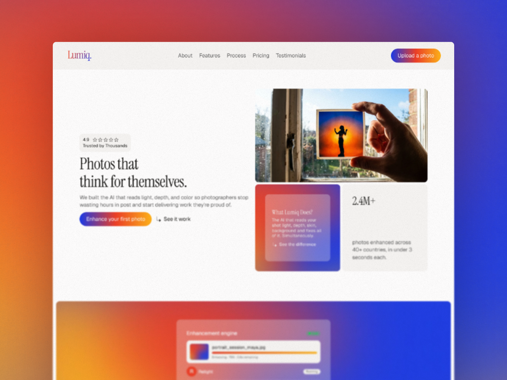

# Lumiq

> Full brand system + Framer landing page for an AI photo enhancement product.
> Built from zero - voice, color, typography, 12 sections, CMS, blog. No Figma handoff. No template.

---

## Live Site

[Lumiq live site](https://lumiq.framer.ai/)

---

## Links

[Upwork Project](https://www.upwork.com/freelancers/himdhara2002?p=2075262751384870912)

[Upwork Profile](https://www.upwork.com/freelancers/himdhara2002?mp_source=share)

[Full Case Study](./CASE-STUDY.md)

---

## Brand System

| Role | Token | Hex | Opacity |
|------|-------|-----|---------|
| Accent - Cobalt | Ascent / Blue | `#1A3AE8` | 100% |
| Accent - Flame | Ascent / Red | `#ED3F27` | 100% |
| Accent - Amber | Ascent / Yellow | `#FEB21A` | 100% |
| Background | Background | `#FDFCFC` | 100% |
| Card | Card BG | `#F5F3F1` | 100% |
| Card Transparent | Card BG - Trans | `#F5F3F1` | 30% |
| Border | Border | `#EDEBE8` | 100% |
| Heading Text | Text | `#1A1917` | 100% |
| Body Text | Body Text | `#616161` | 100% |

**Gradient:** `#ED3F27` → `#FEB21A` left to right on primary CTAs. Hover reversal.

**Typography:**

| Style | Font | Size | Letter | Line |
|-------|------|------|--------|------|
| H1 | `Instrument Serif` Regular | 48px | -0.02em | 1.1em |
| H2 | `Instrument Serif` Regular | 40px | -0.02em | 1.2em |
| H3 | `Instrument Serif` Regular | 33px | -0.02em | 1.2em |
| H4 | `Instrument Serif` Regular | 28px | -0.02em | 1.2em |
| H5 | `Instrument Serif` Regular | 23px | -0.01em | 1.2em |
| H6 | `Instrument Serif` Regular | 19px | 0.01em | 1.3em |
| Body | `Geist` Regular | 16px | -0.01em | 1.4em |
| Small | `Geist` Regular | 13px | 0.01em | 1.2em |
| Button | `Geist` Regular | 16px | -0.01em | 1.4em |
| Button Small | `Geist` Regular | 13px | 0.01em | 1.2em |

**Icons:** Phosphor Icons - duotone weight throughout.

---

## What Was Built

```
Desktop
├── Navigation
├── Main
│   ├── Hero Section
│   ├── About Section
│   ├── Features Section
│   ├── Process Section
│   ├── Pricing Section
│   ├── Blogs Section
│   ├── Testimonials Section
│   └── FAQs Section
├── Footer Section
Tablet
Phone

/blogs
├── Featured Blogs Section
└── All Blogs Section

Blog Detail Page
└── Body Section
```

---

## Built With

- Framer
- Framer CMS (Blog collections)
- Phosphor Icons
- Google Fonts (Instrument Serif, Geist)

---


*Designed & built by Himanshu Dhara - Framer Developer & Brand Designer - 2026*
